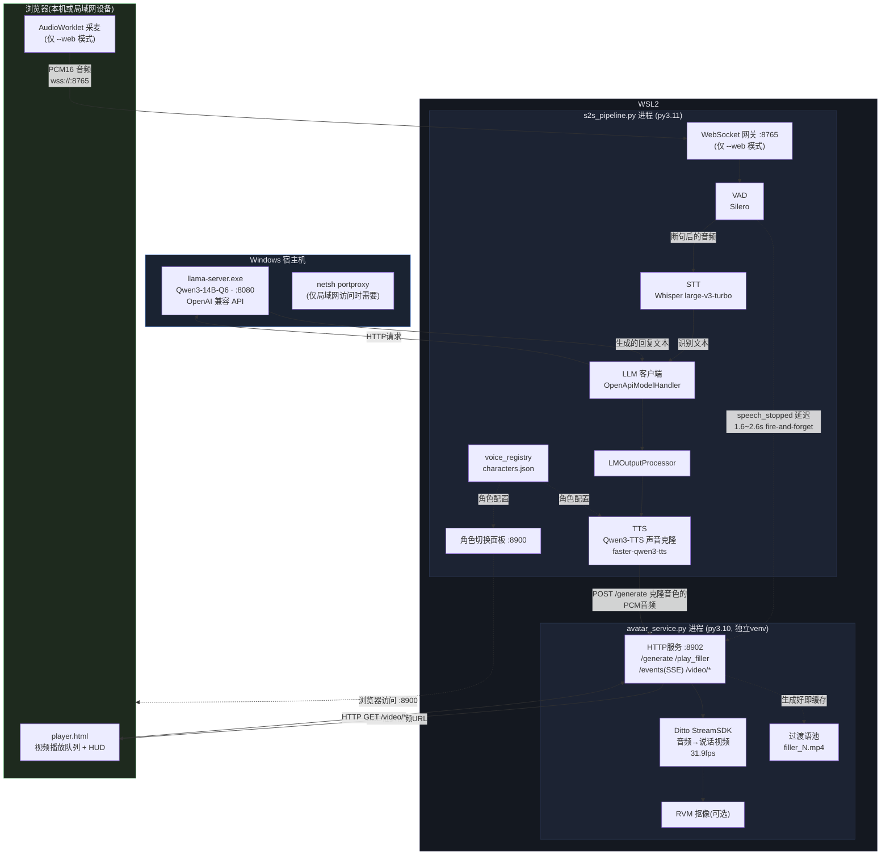
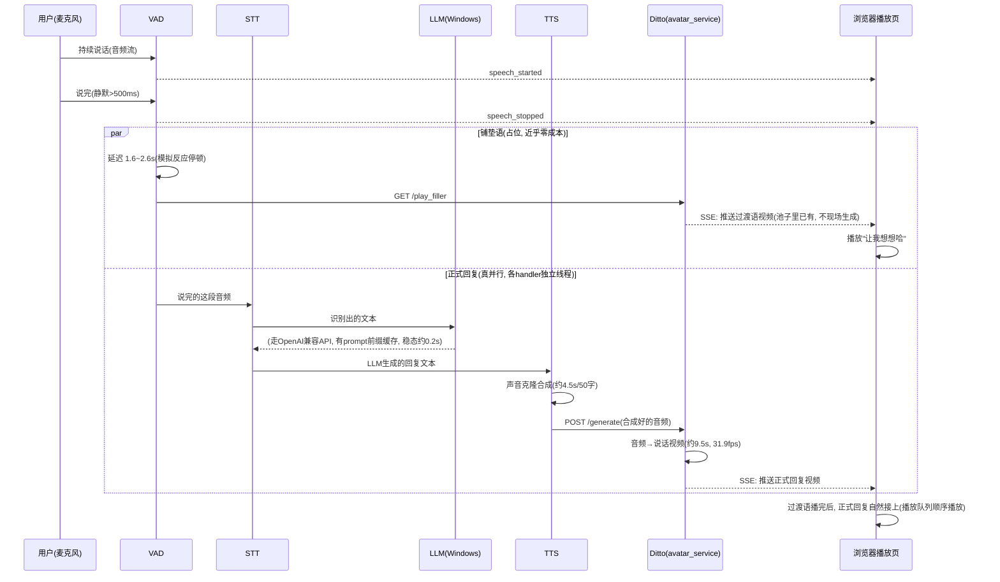

# 系统架构

> 配合 `docs/进度日志.md`(开发过程/踩坑记录) 一起看；这份文档只讲"现在长什么样"，不记流水账。

## 一句话概览

本地、完全离线的语音对话 + 真人数字人形象："你说话 → 她开口回复"整条链路（VAD 断句、STT 转写、LLM 生成回复、TTS 语音克隆合成、Ditto 数字人生成说话视频）全部跑在本机 GPU 上，唯一的例外是 LLM 引擎因为 CUDA 预编译只有 Windows 原生版本，所以单独放在 Windows 侧、WSL 经网关 IP 调用。

## 组件与部署形态

| 组件 | 运行位置 | 端口 | 说明 |
|---|---|---|---|
| `llama-server.exe`(LLM) | **Windows** 原生进程 | 8080 | Qwen3-14B-Q6, OpenAI 兼容 API |
| `s2s_pipeline.py`(语音管线) | WSL2, Python 3.11 venv | — | VAD/STT/LLM客户端/TTS 四个 handler 各一线程，队列串联 |
| 角色切换面板 | 语音管线进程内自带 | 8900 | 读写 `characters.json`，热切换音色/人格 |
| Live2D 形象(旧方案) | 语音管线进程内自带 | 8901 | 已被 Ditto 取代为主方案，代码还在 |
| `avatar_service.py`(Ditto 数字人) | WSL2, 独立 Python 3.10 venv | 8902 | 音频→说话视频，浏览器播放页也是它serve的 |
| WebSocket 网关 | 语音管线进程内自带 | 8765 | 仅 `--web` 模式启动，浏览器采麦入口 |

本机模式（`start_avatar.sh`）浏览器只用来"看"，麦克风走 WSL 的 WSLg PulseAudio。网页模式（`start_avatar.sh --web`）额外起 8765 的 WebSocket 服务 + 两个端口都套自签 HTTPS，浏览器麦克风才能直接采集音频发过来，局域网其它设备也能用（需要 Windows 侧 `netsh portproxy` 转发）。

## 整体架构图

## 一次对话的时序（含铺垫语并行）

## 关键设计取舍

- **LLM 单独放 Windows**：Linux 没有官方 CUDA 预编译的 llama.cpp，WSL 里编译又缺 nvcc；干脆用 Windows 原生 `llama-server.exe`，WSL 经默认网关 IP 访问。
- **Ditto 是独立 Python 3.10 venv**：跟语音管线的 3.11 环境分开，避免依赖冲突；两个进程用 HTTP(+SSE) 通信，不共享内存/进程空间。
- **"网页版"复用 Ditto 的播放页，没有另起一套前端**：`avatar_service.py` 的 `player.html` 本来就是能用的浏览器输出页(SSE 顺序播放视频段)，网页版只是在上面加了麦克风采集(AudioWorklet→WebSocket)，视频播放这一半完全没动。
- **铺垫语是"近乎零成本"的旁路，不是真流式**：过渡语视频是启动时预生成、缓存好的，`/play_filler` 只是从池子里挑一个推给播放队列；真正的回复生成(STT→LLM→TTS→Ditto)在各自线程里正常跑，两者天然并行，不需要额外的并发设计。
- **单卡决定了没有真正的并发对话**：GPU 只有一张，同一时刻只能服务一路 STT/TTS/Ditto 生成；多人同时说话会排队，不是"同时处理"。

## 相关文件速查

| 关注点 | 文件 |
|---|---|
| 全局配置(角色/照片/抠图/STT/VAD/LLM/铺垫语) | `config.env` |
| 启动/停止/状态 | `start_avatar.sh`(真人形象, `--web`开网页版) / `start_live2d.sh` / `stop.sh` / `status.sh` |
| 角色人格/音色/过渡语文案 | `speech-to-speech/characters.json` |
| 语音管线主入口 | `speech-to-speech/s2s_pipeline.py` |
| 浏览器采麦(网页版) | `speech-to-speech/connections/websocket_streamer.py` |
| Ditto 数字人服务 | `ditto-talkinghead/avatar_service.py` + `ditto-talkinghead/player.html` |
| 局域网自签证书(不进仓库) | `certs/` |
| 开发过程/踩坑记录 | `docs/进度日志.md` |
